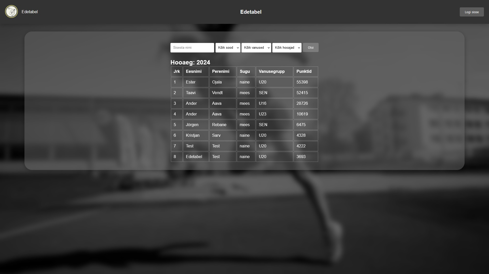
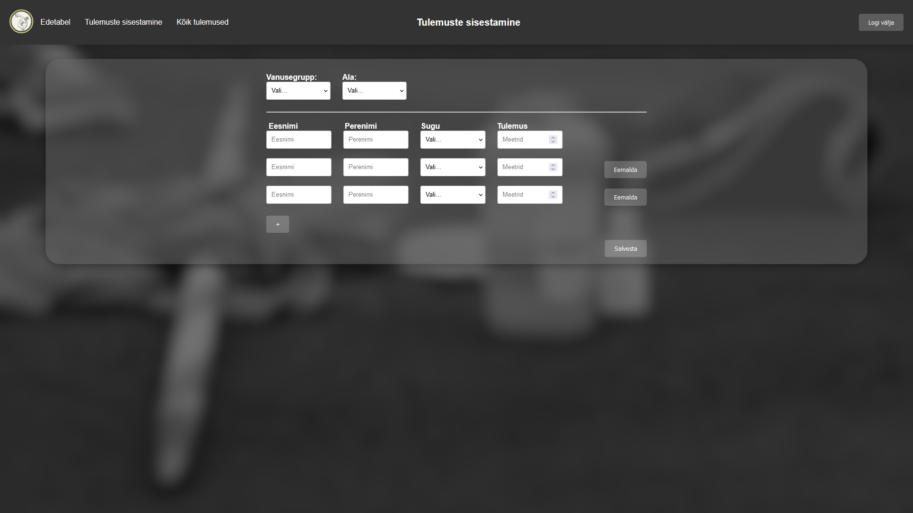
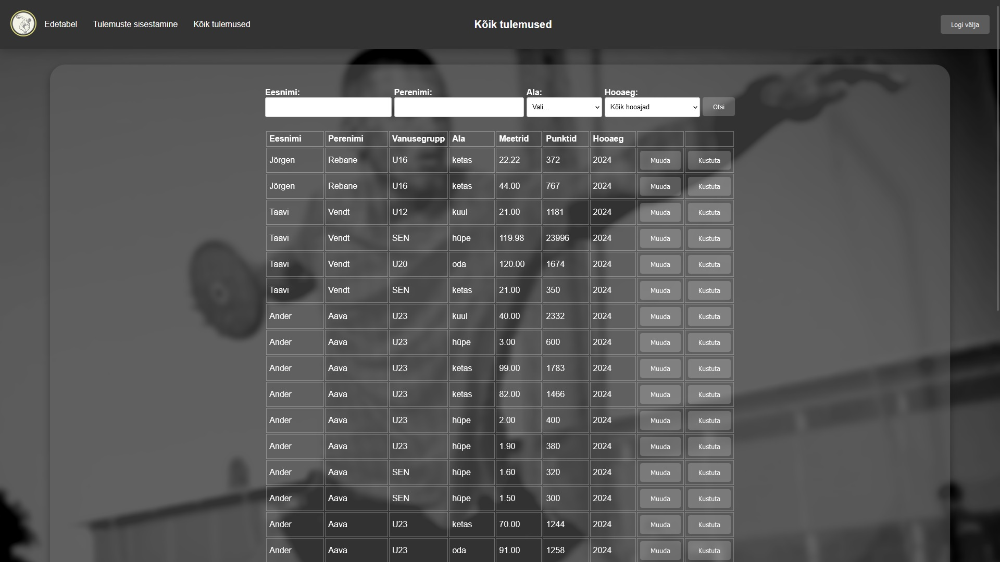

HSPR - Heitespordi Seeriavõistluste Punktiarvestuse Rakendus  

Eesmärk ja lühikirjeldus  

Projekti eesmärgiks oli edasi arendada heitjate seeriavõistluste korraldamiseks loodud veebirakendust, mis lihtsustab võistlustel punktide arvestust ja edetabeli koostamist. Rakendus loob automaatse edetabeli võttes arvesse mitmevõistluse nõuet: sportlase 3+2+1 parima ala tulemust ja 2 hoota kaugushüppe tulemust.
Meie poolt loodud rakenduses on:
* Uuendatud kujundus
* Tulemuste sisestamise on kiirem ja lihtsam
* Lisatud tulemuste ja sportlaste nimede muutmise võimalus
* Edetabeli automaatne uuendus uute tulemuste lisandumisel
* Filtreerimise ja otsimise võimalused edetabelis ja tulemuste tabelis

HSPR veebileht on valminud [Tallinna Ülikooli Digitehnoloogiate instituudi](https://www.tlu.ee/dt) tarkvaraarenduse projekti suvepraktika raames.

Kasutatud tehnoloogiad
* JavaScript ES7
* node.js v16.20.1
* express.js
* HTML5
* MySQL / MariaDB
* CSS3
* Git / GitHub

Projekti autorid  

Taavi Vendt  
Ester Ojala  
Ander Aava  
Kristjan Sarv  
Jörgen Kristofer Rebane

Paigaldusjuhised  

* Lae projekti repositooriumis olevad failid GitHubist alla ja lisa need serverisse loodud kausta (kasutades failide lisamiseks nt WinSCP).
* Loo andmebaasi tabelid kasutades selleks createSQL.txt failis olevaid käske.
* Loo dbConfig.js fail projekti avalikust kaustast välja poole ja muuda sisu vastavalt enda andmebaasi kasutaja andmetega.  
Näide dbConfig.js:  
exports.configData = {  
&emsp;&emsp;&emsp;host: 'hosti nimi',  
&emsp;&emsp;&emsp;user: 'kasutajanimi',  
&emsp;&emsp;&emsp;password: 'parool',  
&emsp;&emsp;&emsp;database: 'andmebaasi nimi'  
};

* Veendu, et src/databasePromise.js failis olev path dbConfig failile oleks õige:
const dbConfig = require('../../dbConfig');
* Terminali kasutades logi sisse oma serverisse ja navigeeri cd käsu abil projekti kausta.
* Käivita veebirakendus kasutades käsku node index.js.  

Litsents  

See projekt on MIT litsentsi all - vaata [LICENSE.md](https://github.com/TLU-DTI/HSPR_ryhm_6/blob/main/LICENSE.md) faili täpsema info jaoks.
